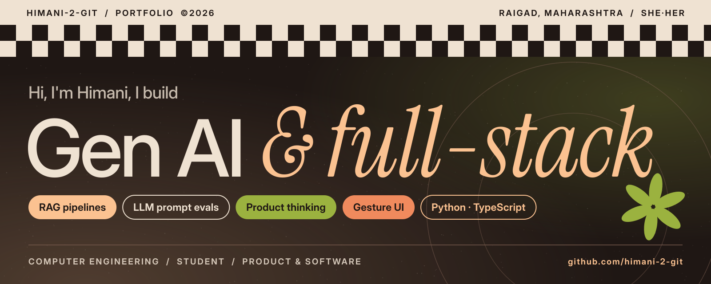
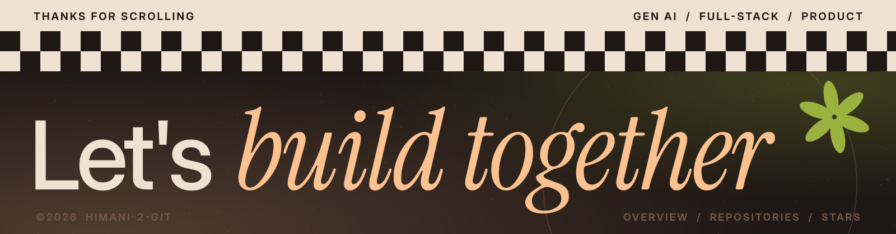

  

  <b>Gen AI</b> &amp; <b>full-stack</b> developer · Computer Engineering student 
  she/her · Raigad, Maharashtra

## ✱ About

I like turning rough ideas into things people can actually use: LLM tooling, retrieval-based assistants, and interfaces that feel a little unexpected (like a photo gallery you control with your hands).

- 🧠 Building with **Gen AI**: prompt engineering, evaluation and **RAG** systems
- 🌐 Shipping **full-stack** products, from the interface to the data layer
- 🖐️ Playing with **gesture-based UIs** in vanilla JS
- 🏥 Prototyping **AI-assisted workflows** for real-world settings
- 📚 Learning in public, one repo at a time

## ✱ Selected work

| Project | What it is | Stack |
| :-- | :-- | :-- |
| [**Fragments**](https://github.com/himani-2-git/Fragments) | Personal photo gallery controlled entirely by hand gestures. Swipe to browse, pinch to focus. No frameworks, no build step. | `JavaScript` `MediaPipe Hands` |
| [**GenAI-Prompt-Evaluation-Lab**](https://github.com/himani-2-git/GenAI-Prompt-Evaluation-Lab) | Interactive lab for designing, testing and evaluating LLM prompts with side-by-side comparisons and token and latency benchmarks. | `Python` `Gemini` `Streamlit` |
| [**labcopilot-portal**](https://github.com/himani-2-git/labcopilot-portal) | AI-assisted lab workflow portal prototype for hospital labs, connecting patients, orders, specimens and results. | `TypeScript` |
| [**Prompt_Engineering_RAG_Chatbot**](https://github.com/himani-2-git/Prompt_Engineering_RAG_Chatbot) | RAG assistant that helps students learn prompt engineering from a syllabus-based knowledge base. | `Python` `Gemini` `Streamlit` |
| [**TeleRAG**](https://github.com/himani-2-git/TeleRAG) | Telegram bot where you upload PDFs and ask grounded questions, using Sentence Transformers, cosine similarity and SQLite. | `Python` `OpenRouter` `SQLite` |
| [**testyAI**](https://github.com/himani-2-git/testyAI) | AI study platform that turns notes and PDFs into flashcards, MCQ quizzes and exam-style questions, and tracks mastery. | `HTML` `AI` |

## ✱ Toolbox

  
  
  
  
  
  
  
  
  

  

<!--
Add your own links here, for example:
[LinkedIn](https://linkedin.com/in/your-handle) · [Email](mailto:you@example.com)
-->
